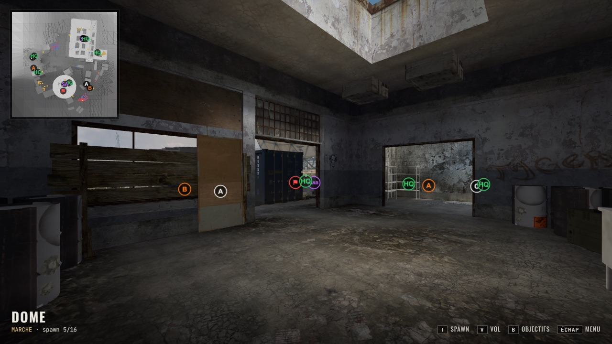

# MWThree — Explorateur MW3 jouable dans le navigateur

Reconstruit un Call of Duty MW3 (2011) jouable dans le navigateur en parsant les fichiers de jeu originaux.

⚠️ **Usage strictement local** — aucun asset n'est redistribué. L'utilisateur doit pointer vers sa propre installation MW3.


## Aperçu (map `mp_dome`)

| Visite des spawns (`T`) | Intérieur, lightmaps et ombres |
|---|---|
|  |  |
| **Objectifs (`B`) et mini-carte** | **Collision (`C`) : brushes + props** |
|  |  |

Ce qui est fait : géométrie du monde, props et entités (véhicules, caisses…), textures et normal maps lues dans les `.iwd`,
lightmaps et soleil de la map, ciel, collision (brushes + props) avec déplacement FPS, objectifs des modes de jeu, mini-carte,
cache des maps décodées. Détails techniques et schémas : [`docs/`](docs/README.md).

---

## Prérequis

- **Node.js** >= 20
- **Navigateur** : Chrome ou Edge (nécessaire pour l'API `showDirectoryPicker`)
- **Installation MW3 locale** : pour tester avec les vrais fichiers

---

## Structure du projet

```
mwthree/
├── docs/                    # Documentation et plan
│   ├── README.md            # Index + schémas (fichiers, lecture de zone, rendu)
│   ├── PLAN.md              # Plan complet du projet
│   ├── RE_NOTES.md          # Format des zones (faits vérifiés)
│   └── SESSION_REFERENCE.md # État et commandes
├── inputs/                  # Fichiers de test
│   └── zone/dome/mp_dome.ff # Map de test (non versionnée)
├── packages/
│   ├── iw5-core/            # Parsers binaires (FastFile, zone, assets)
│   ├── iw5-collision/       # ClipMap → Colliders Rapier3D
│   └── viewer/              # App React Three Fiber
├── package.json             # Root workspace
└── tsconfig.base.json       # Configuration TypeScript de base
```

---

## Commandes

### Lancer le viewer (développement)

```bash
npm run dev
```

Ouvre `http://localhost:5173` :
- Bouton **"Select MW3 Game Folder"** : choisir l'installation MW3 (ou un dossier contenant `zone/<map>/mp_<map>.ff`), puis cliquer une map
- La géométrie de la map est chargée dans un Web Worker (≈ 20–30 s) puis explorable : clic = capture souris, WASD/ZQSD, Espace, Maj, **V = vol libre**
- Dev : `http://localhost:5173/?dev=dome` charge directement `inputs/zone/dome/mp_dome.ff`
- Voir `docs/SESSION_REFERENCE.md` pour l'état détaillé

### Build complet (tous les packages)

```bash
npm run build
```

Construit dans l'ordre :
1. `@mwthree/iw5-core` → `packages/iw5-core/dist/`
2. `@mwthree/iw5-collision` → `packages/iw5-collision/dist/`
3. `viewer` → `packages/viewer/dist/`

### Lancer les tests

```bash
# Tous les tests
npm run test

# Tests d'un package spécifique
npm run test -w packages/iw5-core
npm run test -w packages/iw5-core -- --watch    # mode watch
```

### Vérifier le typage

```bash
npm run typecheck
```

### Linter

```bash
npm run lint
```

### Builder un package spécifique

```bash
npm run build -w packages/iw5-core
npm run build -w packages/iw5-collision
npm run build -w packages/viewer
```

### Installer une dépendance dans un package

```bash
npm install <pkg> -w packages/viewer          # dépendance runtime
npm install --save-dev <pkg> -w packages/viewer  # dépendance dev
```

---

## Développement

```bash
# 1. Cloner
git clone https://github.com/LilyanLefevre/MWThree.git
cd MWThree

# 2. Installer les dépendances
npm install

# 3. Vérifier que tout build
npm run build

# 4. Lancer le viewer
npm run dev

# 5. Sélectionner un dossier MW3 via l'interface
#    (ou ouvrir http://localhost:5173/?dev=dome pour charger inputs/zone/dome/mp_dome.ff)
```

---

## Fichiers de test

La map d'exemple est **`mp_dome`** (Dome), à placer dans `inputs/` (non versionné) :

| Fichier | Taille | Usage |
| :------ | :----- | :---- |
| `inputs/zone/dome/mp_dome.ff` | ≈ 60 Mo | FastFile de la map (format retail `IWff0100`) |
| `inputs/zone/dome/mp_dome_load.ff` | 24 Ko | écran de chargement (non utilisé) |

Ces fichiers proviennent de ta propre installation MW3 (`zone/<langue>/`). Les 16 maps `mp_*` testées
se lisent à l'octet près ; `mp_dome` est celle utilisée pour les tests d'intégration et `/?dev=dome`.

---

## État d'avancement

| Phase | Statut |
| :---- | :----- |
| 0 — Fondations (monorepo, scène 3D, FPS, sélecteur de dossier) | ✅ |
| 1 — Décompression FastFile | ✅ |
| 2 — Zone loader et résolution de pointeurs | ✅ |
| 3 — Collision et déplacement FPS (Rapier3D) | ✅ |
| 4 — Géométrie visuelle (monde, props, entités, LOD, ciel) | ✅ |
| 5 — Textures, normal maps, lightmaps | ✅ (éclairage approché) |
| 6 — Entités et UX explorateur (spawns, objectifs, mini-carte) | ✅ |

Détails : [`docs/`](docs/README.md).

---

## Licence

MIT — code uniquement. Les assets MW3 restent la propriété d'Activision.
