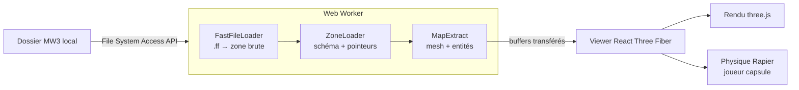
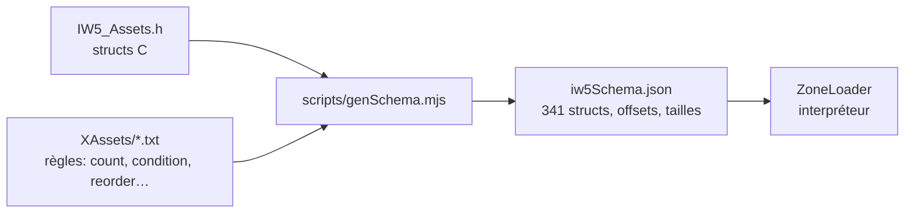

# 01 — Vue d'ensemble

Le travail lourd (décompression, lecture de ~100 Mo de structures) se fait dans un **Web Worker** pour ne pas figer l'interface ; seuls des tableaux typés (`Float32Array`, `Uint32Array`) sont renvoyés à l'interface.

## Paquets

| Paquet | Rôle |
|---|---|
| `packages/iw5-core` | décompression des `.ff`, lecture des zones, extraction du mesh et des entités |
| `packages/viewer` | application web : worker, rendu, joueur |
| `packages/iw5-collision` | à venir : brushes `clipMap_t` → colliders |

## Le principe clé : un schéma compilé, pas du code écrit à la main

Il existe des centaines de structures d'assets (modèles, matériaux, sons…). Plutôt que de les écrire une à une, on réutilise les définitions d'**OpenAssetTools** :

Les tailles calculées sont vérifiées contre les `static_assert(sizeof …)` du header, et l'ensemble est validé de bout en bout : sur les 16 maps testées, la zone est lue jusqu'au dernier octet et les tailles de blocs correspondent à l'en-tête.
