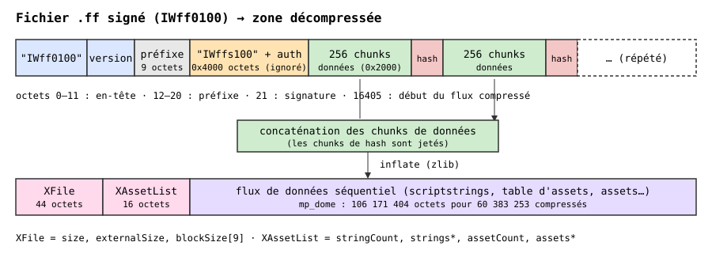
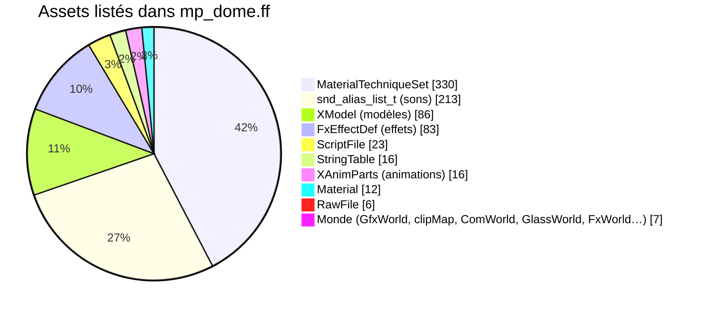
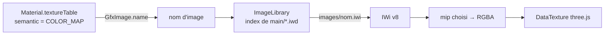

# 02 — Les fichiers du jeu

## Dans une installation

| Fichier | Contenu | État dans MWThree |
|---|---|---|
| `zone/**/mp_<map>.ff` | **FastFile** de la map : géométrie, collision, entités, matériaux, modèles, sons… | ✓ lu |
| `zone/**/mp_<map>_load.ff` | écran de chargement | ignoré |
| `main/*.iwd` | archives zip : textures `.iwi`, sons | ✓ textures lues |

Un `.ff` (« FastFile ») est une zone compressée : les données sont déjà dans le format des structures du moteur, prêtes à être recopiées en mémoire.

## Du `.ff` à la zone

Les `.ff` retail sont **signés** (`IWff0100`) : le flux zlib est entrecoupé de chunks de hash qu'il faut écarter avant de décompresser (`FastFileLoader`).

## Contenu d'une zone de map (exemple : `mp_dome`, 792 assets)

Les assets qui comptent pour explorer la map :

| Asset | Rôle |
|---|---|
| `GfxWorld` | géométrie visible : sommets, indices, surfaces, modèles statiques placés |
| `clipMap_t` | collision : plans, brushes, triangles ; contient aussi les **entités** (`MapEnts`) |
| `MapEnts` | entités : spawns, déclencheurs, props (texte compact `<clé> "<valeur>"`) |
| `XModel` | modèles (props, véhicules) — pas encore affichés |
| `Material` / `GfxImage` | matériaux et références d'images — textures pas encore chargées |

Les images, la plupart des matériaux et des shaders ne sont pas dans la liste d'assets : ils sont stockés *à l'intérieur* des assets qui les utilisent.

## Textures : `.iwd` et `.iwi`

- Un `.iwd` est un zip : on lit uniquement le répertoire central (quelques dizaines de Ko sur ~300 Mo), puis les entrées voulues (lecture aléatoire, `File.slice` ou requêtes HTTP Range). L'index des 49 archives de `inputs/main/` (≈ 24 000 images) se construit en moins d'une seconde.
- Un `.iwi` (version 8) : en-tête de 32 octets (`IWi`, version, flags, format, largeur/hauteur, tailles par niveau de qualité) suivi de la **chaîne de mips du plus petit au plus grand**. Formats gérés : DXT1/3/5, ARGB32, RGB24, GA16, A8.
- On garde le plus grand mip ≤ 512 px pour borner la mémoire. Quand le GPU accepte le S3TC (`WEBGL_compressed_texture_s3tc` + `_srgb`), les images DXT sont envoyées **sans décodage** avec leur chaîne de mips (`iwiCompressedMips`) ; sinon elles sont décodées en RGBA.
- Les **normal maps** sont en DXT5nm : X dans l'alpha, Y dans le vert (R = G = B), Z implicite et Y orienté vers le bas. Elles sont réécrites en carte RGB classique (`toNormalMap`).
