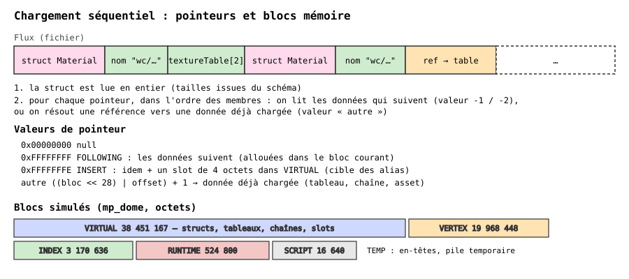
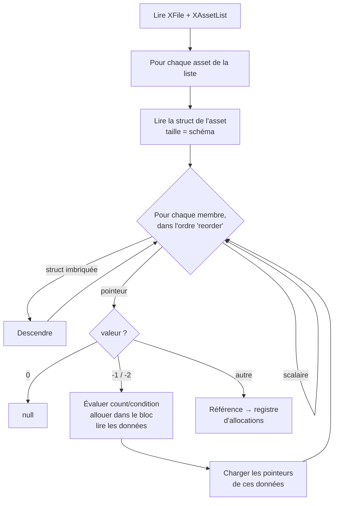

# 03 — Lecture d'une zone

Une zone décompressée est un **flux séquentiel** : on lit chaque structure, puis les données pointées, en profondeur d'abord. Il n'y a ni table d'offsets ni saut possible : pour atteindre le dernier asset, il faut avoir lu correctement tous les précédents. C'est pourquoi la validation « octet près » est le test central.



## Algorithme (simplifié)



Les **règles** (extraites d'OpenAssetTools) pilotent chaque étape :

| Règle | Effet |
|---|---|
| `count` | nombre d'éléments pointés (expression, ex. `numBones - numRootBones`) |
| `condition` | le pointeur n'est chargé que si l'expression est vraie (unions) |
| `string` | le pointeur désigne une chaîne terminée par `\0` |
| `block` | bloc mémoire de destination (ex. RUNTIME : rien dans le fichier) |
| `reusable` | la donnée peut être référencée plus tard par offset |
| `reorder` | ordre de chargement des membres (`...` = « les autres ») |
| `arraysize` | tableau terminal de taille variable |

## Références

Un pointeur « autre » encode `(bloc << 28 | offset) + 1`. Pour les résoudre, le loader **simule l'allocation** de chaque bloc (alignements compris). Trois cibles possibles :

1. une donnée déjà allouée (tableau, chaîne) — éventuellement **au milieu** d'un tableau (pointeur intérieur) ;
2. un **slot d'alias** de 4 octets créé par un pointeur `-2` ;
3. l'**adresse du pointeur** qui contenait un asset (champ `header` d'une entrée de `XAssetList`, ou membre où l'asset a été chargé).

Si la simulation se trompe d'un seul octet, les références dérivent : c'est la deuxième vérification de bout en bout (tailles de blocs = en-tête).

## Vérifier

```bash
npx tsx scripts/loadZone.mts inputs/zone/dome/mp_dome.ff
# OK assets 792 bytesRead 106171404 / 106171404
# header blocks ...   sim blocks ...   (blocs identiques, TEMP exclu)
```
