# 04 — Le rendu et le déplacement

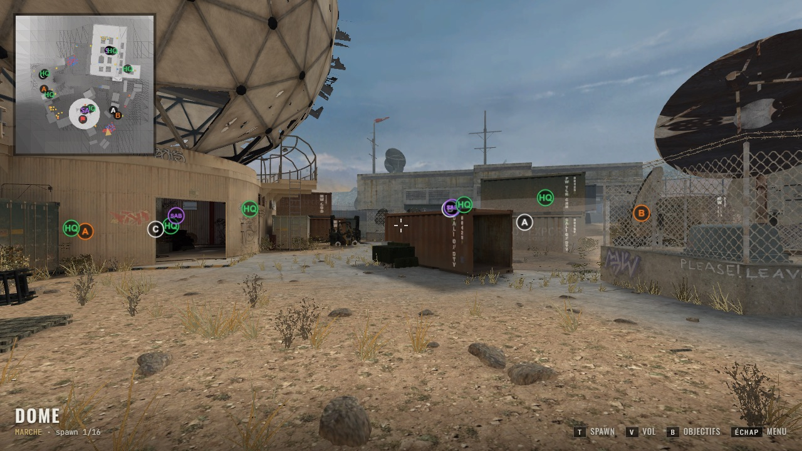

## Du `GfxWorld` à l'écran

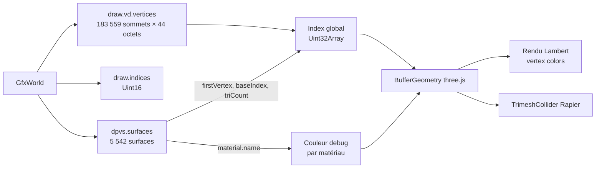

Chaque **surface** référence une plage de sommets (`firstVertex`, `vertexCount`) et une plage d'indices (`baseIndex`, `triCount`) ; les indices sont relatifs à `firstVertex`. Un sommet (`GfxWorldVertex`, 44 octets) contient position, couleur, coordonnées de texture, coordonnées de lightmap, normale et tangente packées sur 4 octets chacune.

Les surfaces sont regroupées **par matériau** (un groupe d'indices par matériau) ; chaque matériau reçoit la texture de sa *color map* si elle a été trouvée, sinon une couleur de debug dérivée du nom. Les textures sont chargées après la géométrie : la map est explorable tout de suite, puis se texture. Les images avec transparence (feuillage, grillages) utilisent un alpha-test à 0,5. ### Ciel

Le ciel est la cube map `GfxWorld.skies[0].skyImage` (un `.iwi` contenant 6 faces du niveau 0 seulement, ordre D3D +X −X +Y −Y +Z −Z, axes du jeu). `cubeToEquirect` la rééchantillonne en image équirectangulaire au format attendu par three.js, utilisée comme fond de scène.

### Lightmaps

Le `GfxWorld` contient des atlas d'éclairage précalculé (`draw.lightmaps`) : un masque de visibilité du soleil (`primary`, L8, 1024×2048 sur `mp_dome`) et l'éclairage indirect (`secondary`, ARGB, 512×2048 = **deux moitiés empilées** de même disposition, à mi-résolution du primary). Chaque sommet porte des coordonnées d'atlas (`lmapCoord`, décalées de 28 octets dans `GfxWorldVertex`) et chaque surface un `lightmapIndex`. Le calcul suit les shaders du moteur (`lm_sun_*` d'IW4 décompilés, voir `RE_NOTES.md`) : `extractLightmaps` combine les deux moitiés H et B du secondary (`H.rgb + B.rgb·k`, `k` tiré d'une direction 2D codée dans leurs alphas) et range le primary dans l'alpha ; le shader des surfaces (`applyLightmapShading`, `materials.ts`) calcule `albédo × ((2·rgb)² + alpha × sat(N·L) × couleur du soleil)`. Le soleil (`ComWorld.primaryLights`, dernière lumière de type soleil) fournit sa couleur et sa direction. Pas de tone mapping (`<Canvas flat>`) : le moteur n'en a pas, et l'ACES par défaut de R3F délavait l'image.

Les props sont éclairés comme dans le moteur, par la **light grid** (`LightGrid.ts`, `computePropLighting`) : chaque instance échantillonne la grille au centre de ses bornes et reçoit un **cube ambiant** (6 couleurs, une par face du cube de 56 échantillons) plus la **part de soleil visible** ; le shader des props (`StaticModels.tsx`, `onBeforeCompile`) calcule, comme les shaders `lp_*_sun`, `albédo × ((2·ambiant(normale))² + soleil × sat(N·L) × part)`. Un prop dans un bâtiment est donc sombre, un prop au soleil prend la lumière directe. Ils gardent leurs normal maps. Les surfaces sans lightmap (index 31) restent éclairées par des lumières three.js classiques. Non reproduits : specular, ombres dynamiques. La multiplication de l'albédo par la couleur de sommet est inutile : hors décalques, toutes les couleurs de sommet du monde sont blanches sur les 16 maps.

### Couches mélangées (rayons, halos, décalques add/multiply)

Certains matériaux ne sont pas éclairés mais **mélangés** au framebuffer : leur technique set (`*_unlit_*` ou `*_effect_*`) se termine par `add`, `screen` ou `multiply` (ex. `wc/ch_godray01` = `wc_unlit_falloff_screen_lin`, les rayons de soleil du bunker de `mp_dome` ; `mc/gfx_floodlight_beam_godray75` = `mc_effect_zfeather_falloff_add_lin_nofog_eyeoffset`, le faisceau d'un projecteur ; les numéros des conteneurs en `add`, les taches en `multiply`). `extractMaterialBlends` relève ce mode pour tous les matériaux (monde, modèles statiques, `XModel`) ; `buildMaterials` en fait un `MeshBasicMaterial` sans lightmap, en mélange `One/One` (add), `One/OneMinusSrcColor` (screen) ou `DstColor/Zero` (multiply), sans écriture de profondeur. L'alpha (texture × couleur de sommet) atténue la couche (vers le noir pour add/screen, vers le blanc pour multiply) ; les techniques `falloff` s'effacent quand la surface est vue par la tranche (|N·V|) ; celles en `_lin` lisent leur texture sans décodage sRGB. Avant, ces surfaces étaient rendues comme des décalques éclairés et opaques : les rayons apparaissaient comme des pavés noirs.

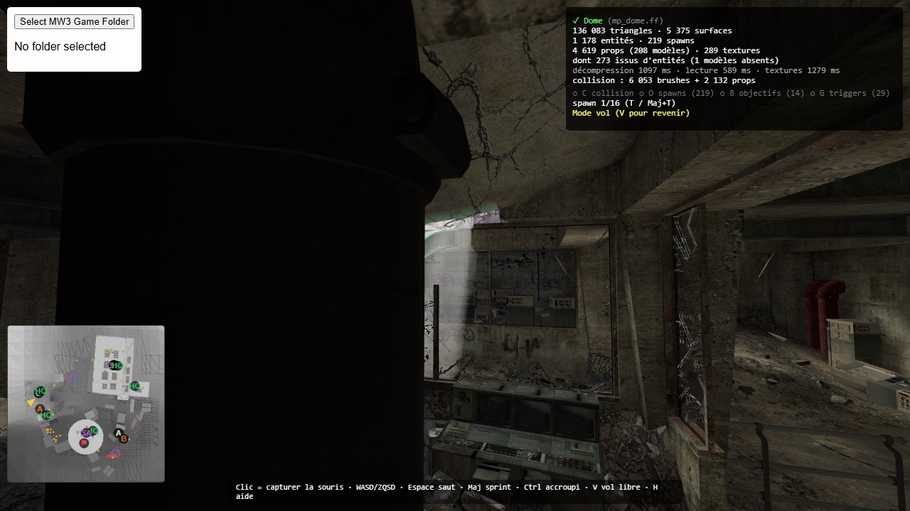

### Brouillard

Le brouillard vient du script `maps/createart/<map>_fog.gsc`, présent en clair (RawFile zlib) dans la zone : `extractFog` lit les `ent.startDist`, `halfwayDist`, `red/green/blue`, `maxOpacity` du premier bloc `create_vision_set_fog` (celui de la map ; les suivants sont des zones locales, ex. `bunker_area` sur `mp_radar`). Le calcul suit `lib/fog.hlsli` des shaders IW4 et `setExpFog` (densité = ln 2 / halfwayDist) : transmission `T = clamp(exp(−(d − start)·ln2/halfway), 1 − maxOpacity, 1)` avec `d` la distance à la caméra (par sommet), puis `mix(couleurBrouillard, couleur, T)` en linéaire. Il est injecté dans tous les matériaux du monde et des props (`addFog`, `materials.ts`, uniforms partagés mis à jour par `setFog`) ; le ciel n'est pas embrumé. Le « sun fog » (5 maps, dont `carbon`, `village`) n'est pas reproduit : seule la couleur de base est utilisée.

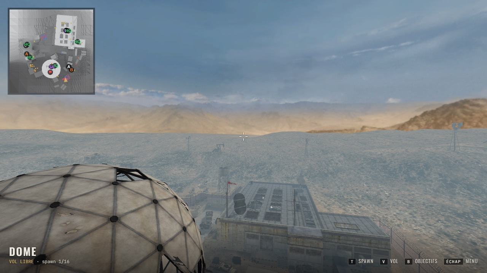

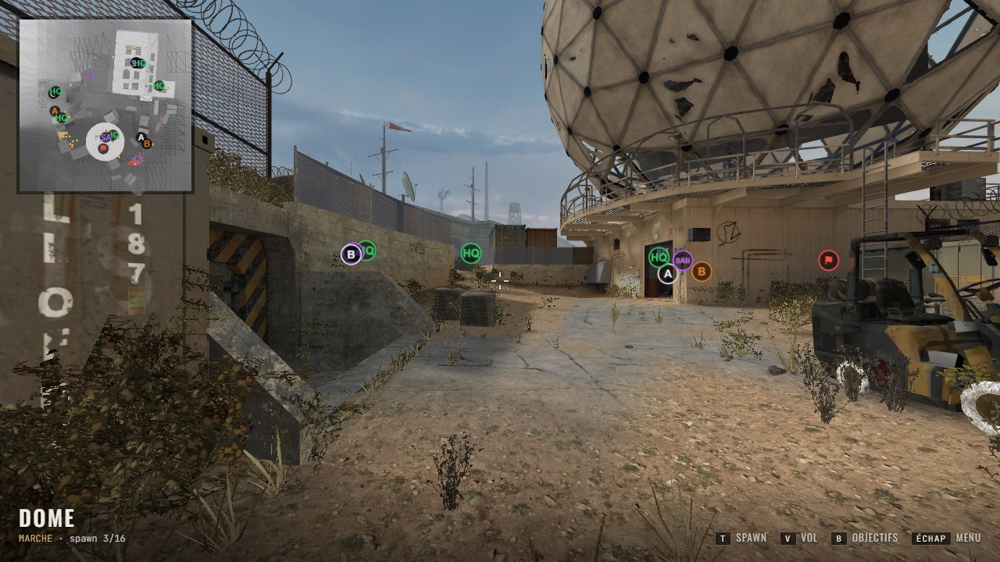

### Modèles statiques (props)

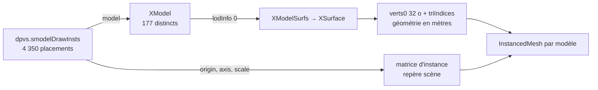

Chaque placement donne une origine, une base orthonormée (`axis`, 3×3) et une échelle ; ils deviennent la matrice d'instance de l'`InstancedMesh` du modèle (≈ 800 000 triangles dessinés pour 108 000 triangles uniques sur `mp_dome`). **Niveaux de détail** : chaque modèle qui en a un garde aussi son LOD 1 ; quatre fois par seconde, les instances plus loin que la distance de bascule du modèle (`lodInfo[0].dist`) passent dans un second `InstancedMesh` en LOD 1. Sur `mp_dome` depuis le premier spawn : 1,18 M → 0,75 M triangles dessinés (`?nolod` désactive les LOD pour comparer ; `window.__render` expose fps/triangles en dev).

**Props issus d'entités** : les entités `script_model` (véhicules, caisses, objets destructibles) sont placées de la même façon, dans leur état intact : le nom du `model` est cherché parmi les `XModel` de la zone, l'orientation vient de `angles` (pitch, yaw, roll). Les modèles absents de la zone sont ignorés (≈ 1 par map sur `mp_seatown`). Ils sont statiques : ni explosion ni physique.

## Repères et sens des triangles

## Entités et point d'apparition

`clipMap_t.mapEnts.entityString` est un texte compact : un bloc `{ … }` par entité, des lignes `<id> "<valeur>"` où l'identifiant est un index dans la table de constantes du moteur. Quelques identifiants sont connus (`1668 classname`, `1669 origin`, `1677 angles`…, voir `ENTITY_KEYS`). Le joueur apparaît au premier `mp_dm_spawn` (sinon un spawn `tdm`, sinon n'importe quel spawn).

## Objectifs des modes de jeu

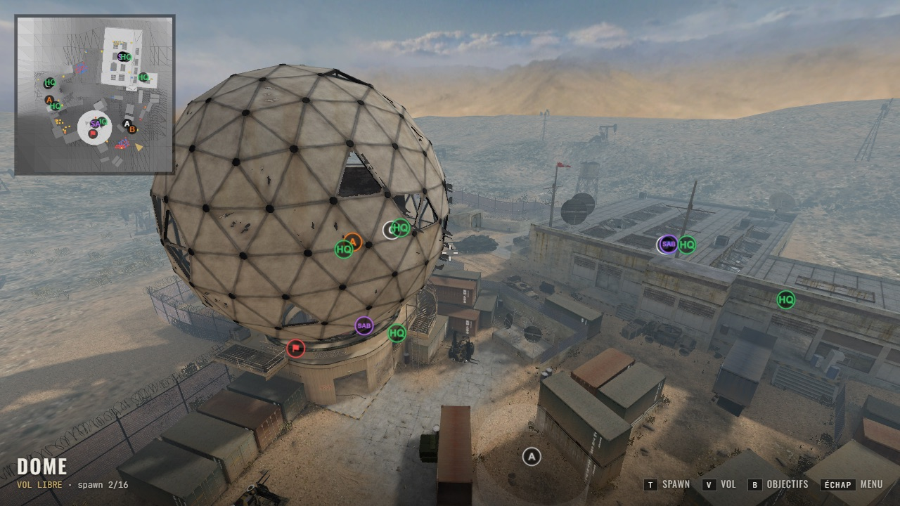

`extractObjectives` repère dans les entités les drapeaux de domination (`targetname = flag_primary`, lettre dans `script_label`, rayon/hauteur de capture), les sites de bombe (`bombzone`), les drapeaux CTF (`ctf_flag_allies/axis`), les points de QG (`hq_hardpoint`) et le sabotage. Le viewer les affiche en étiquettes toujours visibles et sur la mini-carte.

## Triggers

Les entités `trigger_*` avec un modèle `?N` désignent le trigger N de `MapEnts.trigger` : une liste de *hulls* (boîtes relatives à l'origine de l'entité, éventuellement découpées par des *slabs*). `extractTriggers` intersecte chaque boîte avec ses slabs (`|dir·p − midPoint| ≤ halfSize`, en coordonnées locales) avec le même calcul de polyèdre convexe que les brushes de collision (`Convex.ts`), et renvoie le contour exact en coordonnées monde ; touche **G** pour les afficher (`mp_dome` : 29 triggers, dont des zones octogonales et prismatiques).

## Joueur et collision

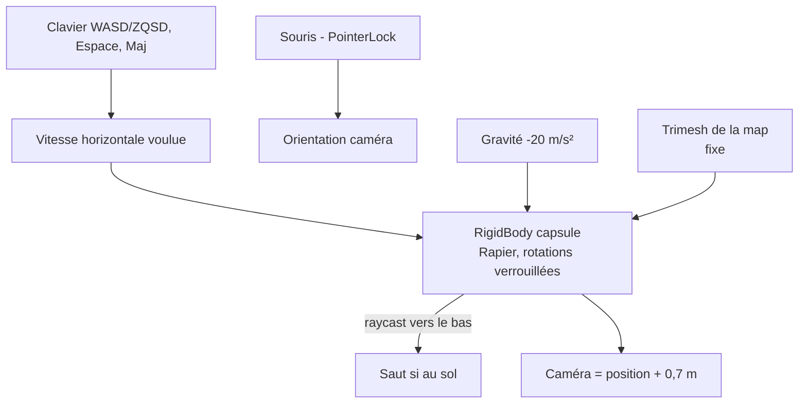

- Capsule : rayon 0,35 m, hauteur 1,6 m ; marche 4,8 m/s (sprint ×1,5), saut 6,5 m/s.
- **Déplacement** : le joueur est un corps cinématique mû par le contrôleur de personnage de Rapier (`Player.tsx`) : marche automatique jusqu'à 0,46 m (la hauteur de marche du jeu : seuils, bordures, barres basses), adhérence au sol, glissement le long des murs, pente maximale de 50°.
- **V** : vol libre (collisions désactivées) pour inspecter la map.
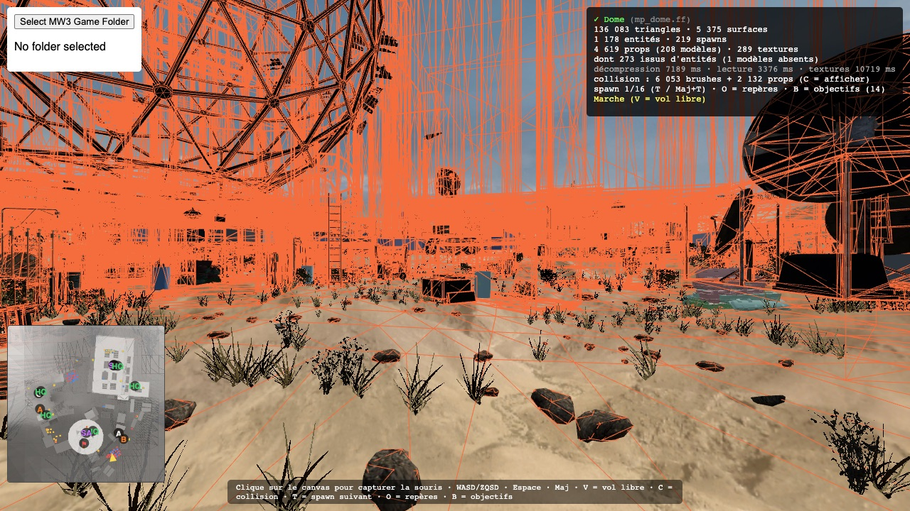

- La collision vient de `clipMap_t` (touche **C** pour l'afficher en fil de fer) :
  - un **brush** est un volume convexe défini par 6 plans axiaux implicites (la boîte `brushBounds`) plus `numsides` plans explicites ; seuls les brushes *solid* ou *playerclip* sont retenus ;
  - chaque brush est converti en polyèdre (intersection des triples de plans, filtrage des points intérieurs, tri des sommets de chaque face) puis triangulé ;
  - les triangles de terrain de `clipMap_t` (`verts`, `triIndices`) sont ajoutés ;
  - les triangles de collision (terrain, patchs, collision de modèles cuite) sont indexés par partition, avec un décalage de `firstVertSegment × 1024` sommets (sans lui, `mp_seatown` avait 12 005 triangles mal placés : des murs invisibles) ;
  - les brushes de tous les sous-modèles `*N` (objets de mode de jeu, déclencheurs, portes : stockés en coordonnées locales et placés par leur entité) sont retirés de la collision statique ;
  - les modèles statiques (`clipMap_t.staticModelList`) n'en font **pas** partie : le moteur ne les teste qu'avec des tracés ponctuels (balles, lignes de visée), jamais avec la boîte du joueur ; les cartes les entourent de brushes de clip là où ils doivent bloquer. Leur ancienne prise en compte (LOD le plus grossier) créait des murs invisibles (herbes hautes, linge, fils, assiettes de `mp_seatown`) ;
  - le tout forme un seul trimesh Rapier (`mp_dome` : 6 053 brushes + 2 132 props, ≈ 270 000 triangles).

## Performance (machine de dev, Chrome)

| Étape | `mp_dome` |
|---|---|
| décompression | ≈ 14 s |
| lecture de la zone | ≈ 11 s |
| extraction du mesh | < 1 s |
| textures (≈ 300 images) | ≈ 11 s en dev (requêtes HTTP Range), après la géométrie |
| rechargement (cache IndexedDB) | ≈ 2,5 s, géométrie et textures comprises |

Pistes : décodage paresseux des structures, moins de copies de tableaux, cache du résultat (IndexedDB).

## Interface

Trois écrans pilotés par `App.tsx` : **menu** (`ui/MainMenu.tsx`), **chargement** (`ui/LoadingScreen.tsx`), **jeu** (`ui/Hud.tsx` + `ui/PauseMenu.tsx`), dans l'esprit des menus de MW3 (2011) : visuels plein cadre, bandes sombres, capitales condensées (Oswald), accent kaki (`ui/ui.css`).

- Les images viennent des `.iwd` de la source choisie : vignettes `preview_mp_<map>_lobby` (512×256, DXT1) et écrans `loadscreen_mp_<map>` (1280×720, BGR non compressé). Elles sont stockées sans mipmaps (`IMG_FLAG_NOMIPMAPS`, bit 1 des flags IWi) ; un worker dédié (`worker/imageWorker.ts`) les décode et les renvoie en JPEG (`OffscreenCanvas`).
- Le texte sous le nom de la map est un texte de remplacement (`mapNames.ts`) : les chaînes d'origine sont dans les zones localisées (`zone/english/*.ff`).
- L'écran de chargement couvre la scène jusqu'à l'arrivée des textures ; la progression combine le téléchargement du `.ff` (maps du serveur), les étapes du worker et le décompte des textures.
- Le menu pause s'ouvre quand la souris est libérée (Échap) ; seul « Reprendre » laisse remonter le clic jusqu'au contrôle de capture du pointeur.

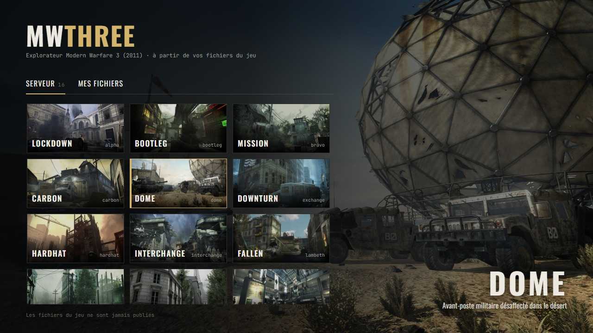
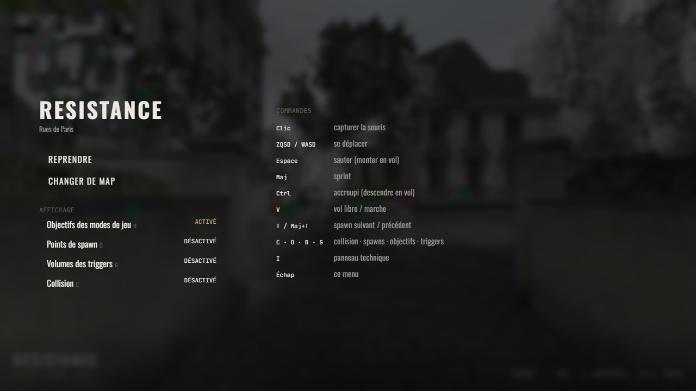

## Textures de remplacement (CC0)

Une image absente des archives chargées est remplacée par une texture libre (ambientCG, CC0, `packages/viewer/public/fallback/`) choisie selon des mots-clés du nom (`worker/fallback.ts`). Les maps de la communauté s'affichent ainsi sans les textures d'Activision. Mesure : Shipment en dev sur Mac, sans aucune archive du jeu, rendu avec pierre, gravier et métal à la place.
