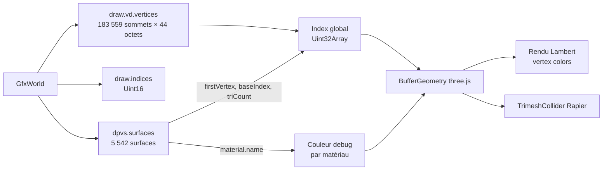
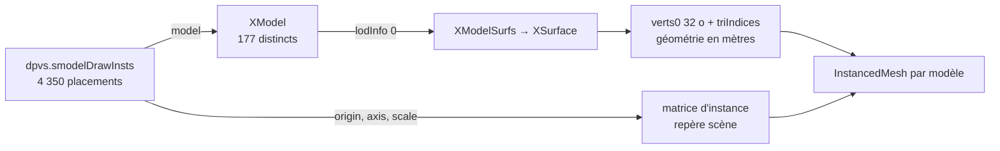
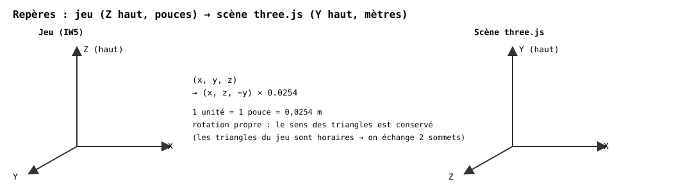
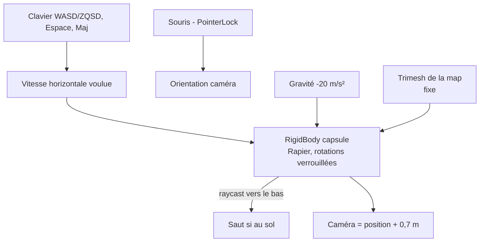

# 04 — Le rendu et le déplacement

## Du `GfxWorld` à l'écran

Chaque **surface** référence une plage de sommets (`firstVertex`, `vertexCount`) et une plage d'indices (`baseIndex`, `triCount`) ; les indices sont relatifs à `firstVertex`. Un sommet (`GfxWorldVertex`, 44 octets) contient position, couleur, coordonnées de texture, coordonnées de lightmap, normale et tangente packées sur 4 octets chacune.

Les surfaces sont regroupées **par matériau** (un groupe d'indices par matériau) ; chaque matériau reçoit la texture de sa *color map* si elle a été trouvée, sinon une couleur de debug dérivée du nom. Les textures sont chargées après la géométrie : la map est explorable tout de suite, puis se texture. Les images avec transparence (feuillage, grillages) utilisent un alpha-test à 0,5. ### Ciel

Le ciel est la cube map `GfxWorld.skies[0].skyImage` (un `.iwi` contenant 6 faces du niveau 0 seulement, ordre D3D +X −X +Y −Y +Z −Z, axes du jeu). `cubeToEquirect` la rééchantillonne en image équirectangulaire au format attendu par three.js, utilisée comme fond de scène.

### Lightmaps

Le `GfxWorld` contient des atlas d'éclairage précalculé (`draw.lightmaps`) : un masque de lumière du soleil (`primary`, 1 octet/pixel) et une couleur de ciel/rebond (`secondary`, RGBA, moitié de largeur). Chaque sommet porte des coordonnées d'atlas (`lmapCoord`, décalées de 28 octets dans `GfxWorldVertex`) et chaque surface un `lightmapIndex`. Le soleil (`ComWorld.primaryLights`, dernière lumière de type soleil) fournit sa couleur et sa direction : les zones éclairées sont teintées avec la couleur du soleil, les ombres avec un ciel froid, et la saturation est légèrement augmentée pour éviter un rendu en niveaux de gris. Les props reçoivent un `directionalLight` orienté et coloré comme le soleil de la map, une **teinte par instance** prise dans le lightmap du sol juste en dessous (rayon vertical dans une grille 2 m de triangles de sol, `computePropLighting`) — un prop à l'ombre est donc assombri comme le sol qui l'entoure, approximation des light probes du moteur — et leurs normal maps (le monde, lui, est éclairé par ses lightmaps : les normal maps n'y apportent rien sans les shaders d'origine). Les deux images sont combinées côté CPU en une seule texture RGBA (`extractLightmaps`) et appliquées en `lightMap` d'un `MeshBasicMaterial` (couleur = albedo × lumière). **La formule exacte du moteur n'est pas reproduite** : les gains sont calibrés à l'œil. Les surfaces sans lightmap (index 31) et les props restent éclairés par des lumières three.js classiques ; pas encore de normal maps ni de shaders d'origine.

### Modèles statiques (props)

Chaque placement donne une origine, une base orthonormée (`axis`, 3×3) et une échelle ; ils deviennent la matrice d'instance de l'`InstancedMesh` du modèle (≈ 800 000 triangles dessinés pour 108 000 triangles uniques sur `mp_dome`). Seul le LOD 0 est utilisé.

**Props issus d'entités** : les entités `script_model` (véhicules, caisses, objets destructibles) sont placées de la même façon, dans leur état intact : le nom du `model` est cherché parmi les `XModel` de la zone, l'orientation vient de `angles` (pitch, yaw, roll). Les modèles absents de la zone sont ignorés (≈ 1 par map sur `mp_seatown`). Ils sont statiques : ni explosion ni physique.

## Repères et sens des triangles

## Entités et point d'apparition

`clipMap_t.mapEnts.entityString` est un texte compact : un bloc `{ … }` par entité, des lignes `<id> "<valeur>"` où l'identifiant est un index dans la table de constantes du moteur. Quelques identifiants sont connus (`1668 classname`, `1669 origin`, `1677 angles`…, voir `ENTITY_KEYS`). Le joueur apparaît au premier `mp_dm_spawn` (sinon un spawn `tdm`, sinon n'importe quel spawn).

## Objectifs des modes de jeu

`extractObjectives` repère dans les entités les drapeaux de domination (`targetname = flag_primary`, lettre dans `script_label`, rayon/hauteur de capture), les sites de bombe (`bombzone`), les drapeaux CTF (`ctf_flag_allies/axis`), les points de QG (`hq_hardpoint`) et le sabotage. Le viewer les affiche en étiquettes toujours visibles et sur la mini-carte.

## Joueur et collision

- Capsule : rayon 0,35 m, hauteur 1,6 m ; marche 4,8 m/s (sprint ×1,5), saut 6,5 m/s.
- **V** : vol libre (collisions désactivées) pour inspecter la map.
- La collision vient de `clipMap_t` (touche **C** pour l'afficher en fil de fer) :
  - un **brush** est un volume convexe défini par 6 plans axiaux implicites (la boîte `brushBounds`) plus `numsides` plans explicites ; seuls les brushes *solid* ou *playerclip* sont retenus ;
  - chaque brush est converti en polyèdre (intersection des triples de plans, filtrage des points intérieurs, tri des sommets de chaque face) puis triangulé ;
  - les triangles de terrain de `clipMap_t` (`verts`, `triIndices`) sont ajoutés ;
  - les modèles statiques qui ont une collision en jeu (`clipMap_t.staticModelList`) ajoutent le maillage de leur LOD le plus grossier, placé avec l'inverse de `invScaledAxis` (`mp_dome` : 2 132 props) ;
  - le tout forme un seul trimesh Rapier (`mp_dome` : 6 053 brushes + 2 132 props, ≈ 270 000 triangles).

## Performance (machine de dev, Chrome)

| Étape | `mp_dome` |
|---|---|
| décompression | ≈ 14 s |
| lecture de la zone | ≈ 11 s |
| extraction du mesh | < 1 s |
| textures (≈ 300 images) | quelques secondes, après la géométrie |
| rechargement (cache IndexedDB) | ≈ 2,5 s, géométrie et textures comprises |

Pistes : décodage paresseux des structures, moins de copies de tableaux, cache du résultat (IndexedDB).
