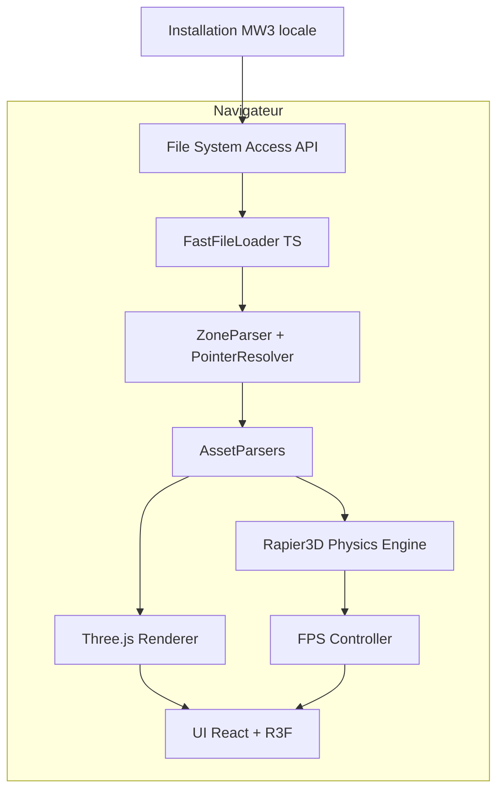
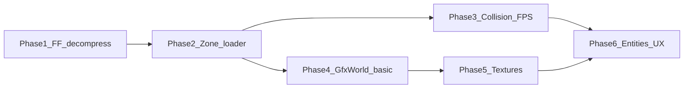

# Plan: MW3 Browser Explorer Project

**Goal:** Reconstruct a playable Call of Duty MW3 (2011) experience in the browser, leveraging actual game files to correctly interpret maps and enable in-game movement.

**Reference map:** `inputs/zone/dome/mp_dome.ff`

---

## Contexte et contraintes

MW3 (IW5) ne shippe pas de .d3dbsp standalone. Chaque map est compilée dans un FastFile (zone/mp_dome.ff) contenant des structs runtime :

| Asset                 | Rôle pour l'explorateur                              |
| :-------------------- | :--------------------------------------------------- |
| `col_map_mp` (clipMap_t) | Collision — plans, AABB trees, tri soup, bords walkables |
| `gfx_map` (GfxWorld)    | Géométrie visuelle — brush models, light grid, probes |
| `map_ents` (MapEnts)    | Entités — spawns, triggers (texte key/value Quake-style) |
| `xmodel`, `material`, `image` | Modèles statiques, shaders, textures .iwi      |

Les textures et sons sont souvent dans des archives [.iwd](https://wiki.zeroy.com/) (zip-like) sous `main/`.

Aucun parser JavaScript/TypeScript complet n'existe pour IW5. Les références à porter sont :

*   **OpenAssetTools (OAT)** — chargement zone, dump partiel IW5
*   **CoD-FF-Tools** — décompression FF, vue col_map_mp
*   **COD Engine Research** — layouts structs, système de pointeurs
*   **KisakCOD** — code décompilé (CM_LoadMapFromBsp, etc.)

**Légal :** Ne jamais redistribuer assets ou maps converties. L'app doit exiger que l'utilisateur pointe vers son installation MW3 locale ; publier uniquement le code viewer.

---

## Architecture cible



**Stack :**

*   TypeScript + Vite — app web
*   Three.js / React Three Fiber — rendu 3D
*   pako — décompression zlib des FF
*   fflate — lecture .iwd (zip)
*   Rapier3D — physique FPS
*   @react-three/rapier — pont Rapier3D ↔ R3F
*   @react-three/drei — utilitaires Three.js

**Option future :** Si le parsing TS devient trop lent, porter le loader OAT en WASM (Emscripten) et l'appeler depuis le navigateur.

---

## Phases d'implémentation

### Phase 0 — Fondations projet (1 semaine) ✓ COMPLETE

**Objectif:** Créer la structure monorepo minimale et une scène de base.

**Structure monorepo :**
```
mwthree/
├── ai/                   # Documents de cadrage (ce fichier)
├── inputs/                # Fichiers de test (zone/dome/)
├── packages/
│   ├── iw5-core/          # Parsers binaires (FF, zone, assets)
│   ├── iw5-collision/     # clipMap_t → mesh + queries
│   └── viewer/            # App React Three Fiber
├── docs/                  # Notes RE, layouts structs
```

**Livrables :**
*   Monorepo structure ✓
*   App Vite + canvas Three.js avec scène de test (box, plan, physique Rapier3D) ✓
*   `FolderSelector` avec `showDirectoryPicker()` ✓
*   Détection des chemins MW3 : `zone/mp_*.ff`, `main/*.iwd` ✓
*   Git initialisé avec commit initial ✓

### Phase 1 — Décompression FastFile (2–3 semaines)

**Objectif:** Lire un .ff PC MW3 (version 0x1, magic IWff0100) et produire la zone décompressée.

**Étapes :**
1.  Parser l'en-tête FF (magic, version) — doc MW2/MW3
2.  PC unsigned path : lire blocs zlib concaténés (header 16-bit size + 0x78DA)
3.  Reconstituer le buffer de la zone brute
4.  **Gestion des erreurs et Robustesse :**
    *   Magic Number/Version incompatibles → arrêt immédiat + message clair
    *   Erreurs de décompression Zlib → `try-catch` autour de `pako`, message convivial
    *   Dépassements/sous-dépassements de buffer → assertions + vérifications
    *   Lectures partielles → vérifier que la quantité attendue est lue
5.  Tests : comparer taille/hash zone avec CoD-FF-Tools ffcli extract

**Critère de succès :** Dump zone identique à l'outil C# de référence pour `mp_dome.ff`.

### Phase 2 — Zone loader et résolution de pointeurs (3–4 semaines)

**Objectif:** Parser la zone comme le moteur IW5 (le cœur du projet).

**Modèle XBlock streams :**
*   Blocs : TEMP, PHYSICAL, RUNTIME, VIRTUAL, LARGE, CALLBACK, VERTEX
*   Types de pointeurs : 0 (null), -1 (inline), -2 (insert), offset encodé (blockIndex << 28) | offset
*   Stack push/pop entre blocs lors du chargement des assets

**Étapes :**
1.  Lire en-tête XFile → tailles de blocs
2.  Lire XAssetList (script strings + table d'assets)
3.  Résoudre script strings
4.  Itérer assets (type, pointer) — énumérer types IW5 depuis OAT et KisakCOD
5.  Priorité : ASSET_TYPE_CLIPMAP, ASSET_TYPE_GFXWORLD, ASSET_TYPE_MAP_ENTS, ASSET_TYPE_XMODEL, ASSET_TYPE_MATERIAL, ASSET_TYPE_IMAGE
6.  **Gestion des erreurs :**
    *   Résolution de pointeur invalide → log détaillé, saut d'asset
    *   Types d'assets inconnus → avertissement, skip
    *   XAssetList corrompue → validation des champs critiques
    *   Structures malformées → vérification des plages attendues
    *   Journalisation complète des erreurs
    *   Retour utilisateur pour les erreurs critiques

**Critère de succès :** Extraire `MapEnts.entityString` lisible depuis `mp_dome.ff`.

### Phase 3 — Collision et déplacement FPS (2–3 semaines)

**Objectif:** Se déplacer correctement dans la map avec Rapier3D.

**Parser `clipMap_t` (struct MW3) :**
*   Plans, nodes, leafs
*   cLeafBrushNode, cbrush_t, cbrushside_t
*   Tri soup collision (cm.tris, cm.triIndices)
*   Static model collision

**Pipeline :**
1.  Convertir clipMap_t en colliders Rapier3D :
    *   Brushes → `ColliderDesc.cuboid()` / `roundCuboid()`
    *   Tri soup → `ColliderDesc.trimesh()`
    *   Static models → colliders appropriés
2.  Requêtes via Rapier3D : raycast sol, glissement murs
3.  Constantes MW3 : units → mètres, joueur ~56 units haut, yeux ~60 units
4.  Contrôleur FPS : WASD, souris, saut, gravité

**Critère de succès :** Marcher sur le sol de `mp_dome` sans traverser murs/sol.

### Phase 4 — Géométrie visuelle (3–4 semaines)

**Objectif:** Voir la map (même partiellement texturée).

*   Parser GfxWorld (brush models, static model placements)
*   Parser XModel (sommets, indices, surfaces)
*   Rendu gris/debug + wireframe toggle
*   Ignorer Umbra dPVS → frustum culling Three.js

**Critère de succès :** Silhouette reconnaissable de `mp_dome` + déplacement collision aligné.

### Phase 5 — Textures et IWD (2–3 semaines)

**Objectif:** Textures approximatives.

*   Lire .iwd avec fflate
*   Parser .iwi v0x08 (DXT1/3/5) → Three.js
*   Parser Material : $colorMap, $normalMap
*   Limitations v1 : pas de spec, pas de shaders originaux, normal maps approximatives

### Phase 6 — Entités et UX explorateur (1–2 semaines)

**Objectif:** Enrichir l'expérience "explorateur".

*   Parser MapEnts.entityString → JSON
*   Overlays debug : spawns, triggers, volumes
*   UI : sélecteur de map, position, noclip, téléport
*   Chargement progressif + barre

---

## Risques majeurs et mitigations

| Risque                             | Impact                      | Mitigation                                                                      |
| :--------------------------------- | :-------------------------- | :------------------------------------------------------------------------------ |
| Structs IW5 incomplètement documentées | Crash / données corrompues | Tests byte-level vs OAT ; map pilote `mp_dome` ; logs hex diff               |
| GfxWorld trop complexe             | Pas de rendu complet        | Phase 4 partielle : brushes d'abord, xmodels ensuite                            |
| Perf navigateur (gros FF)          | OOM / freeze                | Streaming par asset ; Web Workers ; WASM si besoin                              |
| FF signés PC                       | Échec chargement            | Cibler PC retail (unsigned zlib path) ; ignorer signature check en local        |
| C&D Activision                     | Projet arrêté               | Usage strictement local, pas de CDN assets, disclaimer clair                    |

---

## Ordre de priorité (MVP jouable)



**MVP = Phases 1–3 + rendu debug Phase 4 (gris) + entités Phase 6.**

---

## Ressources de référence

*   COD Engine Research — FastFiles : https://wiki.zeroy.com/
*   OpenAssetTools IW5 sources : https://github.com/OpenAssetTools/OpenAssetTools
*   CoD-FF-Tools : https://github.com/zyphide/CoD-FF-Tools
*   ZeroRadiant d3dbsp lumps (concepts brushes/planes)

---

## Estimation globale

| Phase                 | Durée estimée           |
| :-------------------- | :---------------------- |
| 0 Fondations          | 1 sem ✓                 |
| 1 FF decompress       | 2–3 sem                 |
| 2 Zone loader         | 3–4 sem                 |
| 3 Collision + FPS     | 2–3 sem                 |
| 4 GfxWorld            | 3–4 sem                 |
| 5 Textures IWD        | 2–3 sem                 |
| 6 UX entités          | 1–2 sem                 |
| **Total MVP**         | **~4–6 mois (solo, temps partiel)** |

**Fallback :** Si bloqué après 4–6 semaines sur Phase 2, wrapper WASM autour du loader OAT existant.
