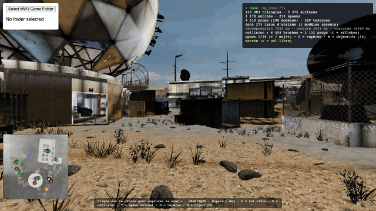

# Documentation MWThree

MWThree lit les fichiers d'une installation MW3 (2011) **locale** et affiche/explore les maps multijoueur dans le navigateur.
Aucun asset du jeu n'est distribué. Les captures de `docs/images/screens/` montrent le rendu du viewer sur `mp_dome` ; les schémas décrivent les formats.

| Page | Contenu |
|---|---|
| [01 — Vue d'ensemble](01-vue-ensemble.md) | architecture, flux de données du disque à l'écran |
| [02 — Les fichiers du jeu](02-fichiers.md) | `.ff`, zone, `.iwd`/`.iwi`, ce qu'il y a dans une map |
| [03 — Lecture d'une zone](03-lecture-zone.md) | pointeurs, blocs mémoire, schéma OpenAssetTools |
| [04 — Le rendu et le déplacement](04-rendu.md) | du `GfxWorld` au mesh three.js, collision, repères |

Notes de travail : [RE_NOTES](RE_NOTES.md) (faits vérifiés), [SESSION_REFERENCE](SESSION_REFERENCE.md) (état et commandes), [PLAN](PLAN.md) (feuille de route initiale).
